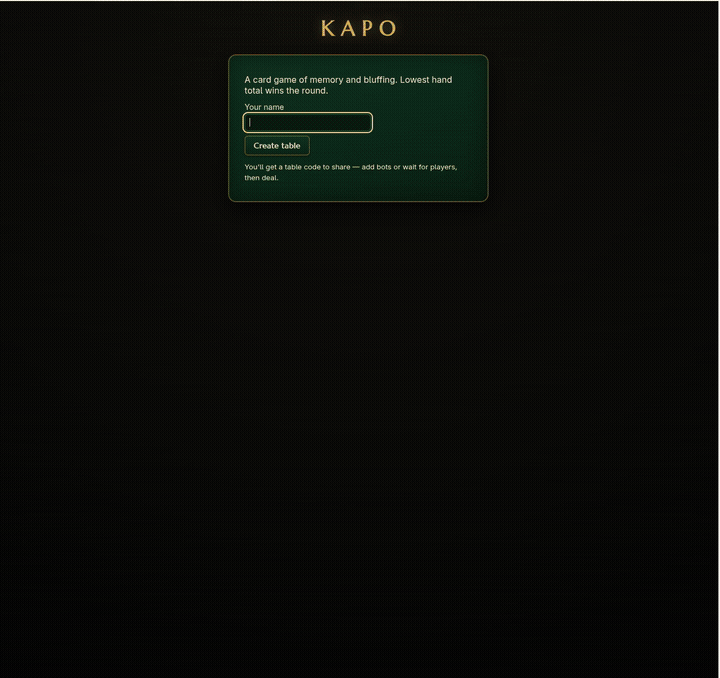

# Kapo

A card game of memory and bluffing. You've only seen half your own hand — keep your total low, then call **Kapo** before anyone beats you to it.

Play in the browser against bots or friends (shared table code), or in the terminal.



## Run

```sh
# Web version — create a table, share the code, add bots, deal
go run ./cmd/el-kapo-web        # http://localhost:8080

# Terminal prototype vs 1-3 bots
go run ./cmd/el-kapo
```

## Rules

- 52-card deck: A–Q in all four suits, plus 2 Kings and 2 Jokers.
- Values: Ace 1, number cards face value, Jack 11, Queen 12, King 13, Joker 0. **Lowest hand total wins the round.**
- Deal: 4 face-down cards each; you peek at 2 of your own, then they flip back. From there it's memory.
- On your turn: draw from the deck, take the top discard, or call **Kapo**.
  - A drawn card is swapped into a slot (the replaced card goes to the discard) or discarded face-up.
- Discarding a drawn card can trigger its power:
  - **7 / 8** — peek one of your own cards
  - **9 / 10** — peek an opponent's card
  - **J / Q** — blind-swap one of your cards with an opponent's
- Combo: swap a card in while dropping 2+ of your own of the same rank. All match → hand shrinks. Any mismatch → those cards flip face-up and your hand grows.
- **Kapo**: callable only at turn start; everyone else gets one final turn, then hands reveal.
- 2 Kings + 2 Queens in hand wins the round outright.
- Match scoring: round winners score 0, everyone else adds their hand total. Hitting exactly 100 drops you to 50; first over 100 ends the match, lowest total wins.

## Development

```sh
go test ./...
```

Web UI is server-rendered Go templates + htmx with SSE pushes; bots play automatically. See `pkg/game` for the engine, `pkg/server` for the web table, `pkg/ai` for bot strategy.
